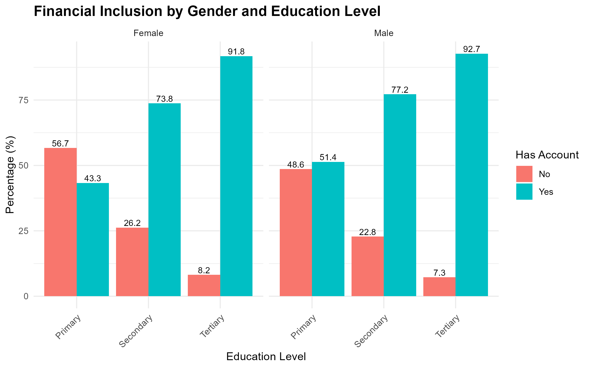
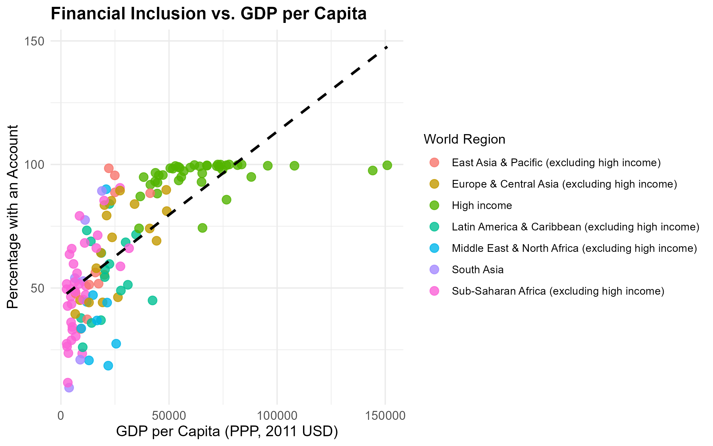

# MyRProject

This project analyzes microdata from 2021 to explore financial inclusion trends.

## Task Overview

Perform the following tasks in RStudio:

- Operationalization and data preparation
- Descriptive statistics
  - Bar plot
  - Scatter plot
- Inferential statistics
  - OLS linear regression

## Data source

The Micro-Dataset and related resources come from:

**“The Global Findex Database 2021: Financial Inclusion, Digital Payments, and Resilience in the Age of COVID-19”**  
[https://www.worldbank.org/en/publication/globalfindex](https://www.worldbank.org/en/publication/globalfindex)

The Macro data (country-level) comes from the World Bank Development Indicators  
[https://databank.worldbank.org/reports.aspx?source=2&country=ARE](https://databank.worldbank.org/reports.aspx?source=2&country=ARE)

## Plots

### Financial Inclusion by Gender and Education Level  

### Financial Inclusion vs GDP per Capita  

## How to use

Open the R project file in RStudio and run the scripts.

